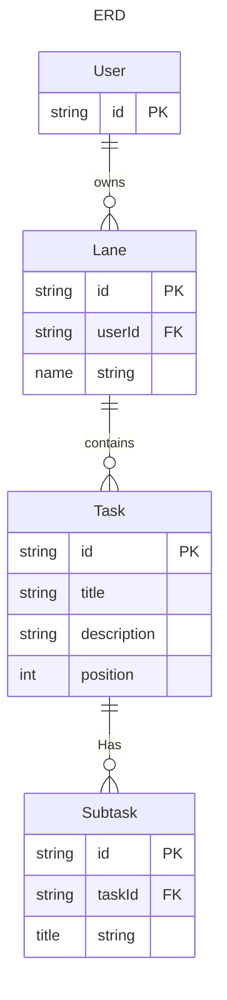

```mermaid
---
title: ERD
---
erDiagram
  User {
    string id PK
  }

  Task {
    string id PK

    string title
    string description

    int position
  }

  Subtask {
    string id PK
    string taskId FK

    title string
  }

  Lane {
    string id PK
    string userId FK

    name string
  }

  User ||--o{ Lane: owns

  Task ||--o{ Subtask: Has

  Lane ||--o{ Task: contains
```
